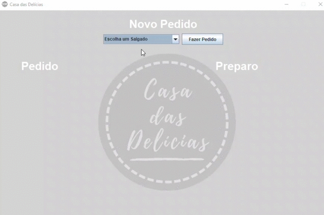

# Casa das Delícias

> Proposta de projeto para a disciplina de Padrões de Projeto de Software Orientado a Objetos, onde são utilizados cinco padrões (Facade, Singleton, Template Method, Adapter e Decorator) para representar a produção de massas salgadas, permitindo extensão para produção de variantes doces sem comprometer a integridade da arquitetura da aplicação.

